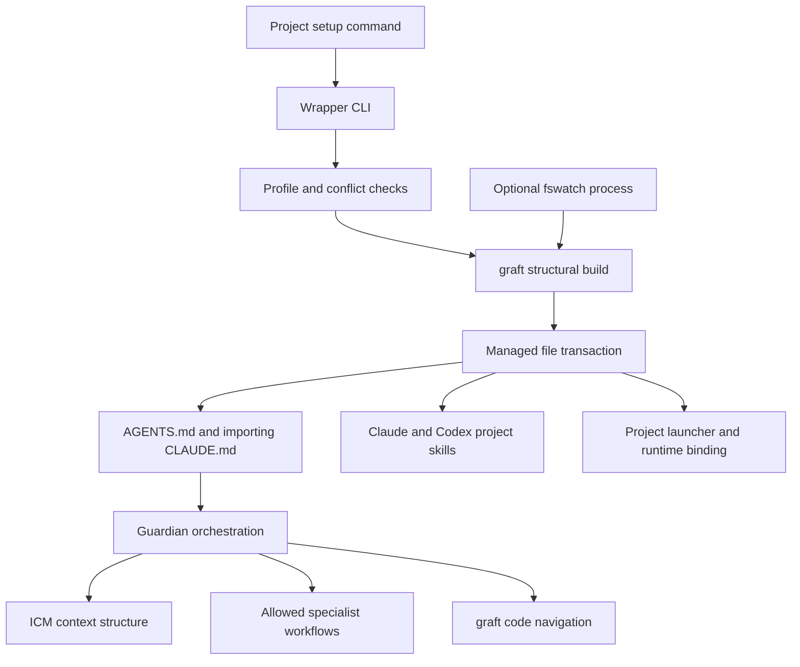

# Architecture and provenance

## What the package is for

A repeatable, project-local foundation for AI-assisted software work. The intended outcome is that an agent can recover the relevant project facts, understand code dependencies, choose a suitable method, make a bounded change and report real verification evidence across sessions. ADHD communication keeps progress and decisions easier to follow; it is a communication preference rather than a clinical feature.

## Components

| Component | Role | Delivered form |
| --- | --- | --- |
| Guardian | Entry point and orchestration for adopt/setup/change/fix/verify/status/doctor | Adapted skill with references and record templates |
| ICM Architect | Structure durable context, maps and selective context loading | Bundled core skill; Guardian routes to it when needed |
| guardian-i-have-adhd | Short, actionable communication and reduced cognitive load | Original explicit-only skill plus generated startup reference |
| Karpathy guidelines | Four coding behavior principles inspired by Karpathy | Unchanged pinned core skill; shared instructions point to it |
| Matt Pocock collection | Engineering, productivity and specialist workflows | All 37 upstream skills, selectable groups |
| graft 0.21.1 | Structural repository graph and code retrieval | Pinned npm runtime; project-local graph |
| Wrapper CLI | Install, update, inspect, configure, remove and export | Strict TypeScript compiled to Node ESM |
| Project watcher | Rebuild graph after editor changes in one root | Bash/fswatch script and debounced Node event handling |
| Claude plugin adapter | Namespaced skill distribution and optional ADHD SessionStart | Exported native Claude plugin; project init remains necessary for graph/runtime |
| Codex adapter | Project skill discovery and invocation policy metadata | .agents/skills; no native Codex plugin in v1 |

Guardian includes ICM as a bundled dependency and routing contract. It does not paste every ICM instruction into Guardian's entry file. This keeps specialized context loaded when relevant.

## Execution flow

Initial structural graph generation precedes instruction installation. If it fails, no completed setup is claimed. Writes are preflighted, locked and rolled back on handled errors. Uninstall restores recorded originals or removes owned instruction blocks. Editing owned files requires reconciling changes before update/removal; edits outside blocks survive.

The runtime stays with the wrapper installation. Target applications do not gain npm dependencies automatically. The generated launcher stores a machine-local path; re-init after moving or reinstalling the wrapper. Graph/cache and runtime files are local, while selected skills and instruction blocks can be reviewed as project changes.

## Source map

| Path | Responsibility |
| --- | --- |
| src/cli.ts | Commands, profile parsing, doctor and orchestration |
| src/install.ts | Desired project files, ownership and restoration |
| src/files.ts | Safe paths, hashing, locks, transaction and rollback |
| src/graft.ts | Pinned graph runtime, build lock and watcher event queue |
| src/plugin.ts | Claude export |
| src/chats.ts | Bounded local/export conversation discovery, explicit selection and provenance-preserving evidence packets |
| src/migration.ts | Bounded document inventory and local migration review brief; no automatic semantic imports |
| src/onboarding.ts | Explicit interactive Claude/Codex launch with the review workflow supplied; preserves existing briefs on resume |
| src/bundle.ts and src/types.ts | Bundle metadata and typed boundaries |
| assets/catalog.json | Skill selection and invocation-policy inventory |
| assets/skills | Vendored instructions and supporting resources |
| assets/scripts | Project launcher, watcher and plugin hook |
| scripts | Asset locking and consistency checks |
| test | Installation and graph integration tests |

## Exact foundations

- Guardian: user-supplied 0.3.0 adapted for wrapper 0.2.0. The original installer embedded Guardian only; it was not a complete ICM/Matt distribution. Supplied installer and watcher informed the design; the Python installer is replaced by the TypeScript CLI and the watcher is rewritten.
- ICM: RinDig/icm-architect at e16cafe6a664dcf6d787a726b452adba77d913f4, MIT Jake Van Clief. Entry templates now use AGENTS.md authority and CLAUDE.md import.
- Matt: mattpocock/skills at d81f3a183412e71a5b1e84ca21bc1a35eea03a60, upstream plugin 1.2.3, MIT Matt Pocock. Full resources and original explicit-only policy are retained; Codex metadata is added where needed.
- ADHD: supplied local snapshot of ayghri/i-have-adhd, MIT Ayoub Ghriss. No upstream revision is claimed. Startup communication is generated from the skill body; the old global hook is excluded.
- Graft: @nanonets/graft 0.21.1, MIT; upstream trailhq/Graft. Native parsers and optional provider SDKs arrive through npm.

The adapted Guardian uses Matt's current GLOSSARY.md convention. Existing ICM human review gates remain. Original Guardian project-specific guidance and legacy Python doctor are removed. Source descriptors and every distributed asset hash are in sources.lock.json; license texts and adaptations are in THIRD-PARTY-NOTICES.md.

## Boundaries

Skills are instructions interpreted by a model. They do not create compiler rules, merge gates or process permissions. Some upstream skills propose commits, tracker writes, hooks or additional packages; those actions still require applicable project/user authorization. All skills being installed does not mean all have run or work in every project. Doctor checks file integrity and tool presence, not semantic adoption or host capability.

No global agent configuration is changed by init. Deep summaries may send source content to a selected provider; default structural builds do not make LLM calls. Graft telemetry is disabled for wrapper calls, although upstream npm version checks can still use the network. MCP/cloud installation and autonomous services are outside v1.

## Locked graft runtime

`runtime/package.json` and `runtime/npm-shrinkwrap.json` define a separate npm installation root. `scripts/install-runtime.mjs` runs npm ci there during package postinstall, preserving the argparse security override for source and tarball consumers. `src/graft.ts` resolves graft from this directory. Native parser modules are installed on the user’s platform rather than bundled from the maintainer’s machine. The wrapper root has only development dependencies; audit both roots.

## Optional orchestration and maintenance

Project profiles include `orchestration` (false for new and legacy profiles). Managed guidance advertises delegation only when enabled. Guardian routes explicit coordination requests to its orchestration reference, grounded in pinned Matt research, code-review and TDD methods. `src/workflows.ts` validates the installed profile/integrity and opens the selected interactive Claude/Codex CLI with the shared workflow and literal task/scope. The host owns subagent execution, permissions and authentication; no scheduler, global config or custom agent definition is installed. Missing delegation falls back to sequential work with an explicit limitation.

`maintain` defaults to app dependency inspection; wrapper/skills/all are selectable. It starts an agent-led proposal/apply/verify session and does not directly run a package manager. Concrete dependency changes need review in that conversation. Consumer wrapper/skill upgrades use reviewed releases; editing bundled upstream snapshots requires an authorized wrapper source checkout. `update` retains its narrower meaning of reapplying the executing package to a project.

Weekly Dependabot proposals cover source root npm, isolated runtime npm and Actions. The runtime package-lock mirrors its release shrinkwrap for GitHub dependency-graph discovery; asset checks enforce equality. Postinstall still consumes only the reviewed runtime shrinkwrap. Neither Dependabot nor Guardian automatically merges upgrades or treats an audit pass as compatibility evidence.

## Karpathy-inspired guidelines source

`karpathy-guidelines` is a fourth core skill from multica-ai/andrej-karpathy-skills at `2c606141936f1eeef17fa3043a72095b4765b9c2` (upstream plugin 1.0.0). Its frontmatter name is adapted to guardian-karpathy-guidelines and its behavioral body is retained; the wrapper adds licensing evidence and pointers from shared project guidance and Guardian integration. No upstream root CLAUDE.md, marketplace, Cursor rule or runtime code is imported. Existing project instructions are preserved by the normal managed-block installation. The package is inspired by Karpathy's observations and names forrestchang in its upstream plugin manifest; it is not attributed as software authored by Karpathy.

## Namespaced skills and Ponytail adaptation

The 42 catalog skills use guardian- names, including guardian-main. Source names are retained separately. Profile selection resolves legacy names only at install planning, so old manifests can still be integrity-checked/uninstalled before migration; owned paths/hashes remain authoritative. Updates create new owned paths and remove old owned files in the same existing transaction. User-modified owned bytes still block updates. Cross-skill call references are adapted while upstream URLs/resources/licenses and invocation policies remain intact.

Ponytail supplies a decision ladder in Guardian's change reference and the optional guardian-audit skill in misc. Audit launches through the existing interactive workflow dispatcher and validates that the skill is selected. It reports only, in the user's language; the host executes instructions, so static/dispatch checks do not certify a semantic audit. No hooks or persistent Ponytail modes are imported.
